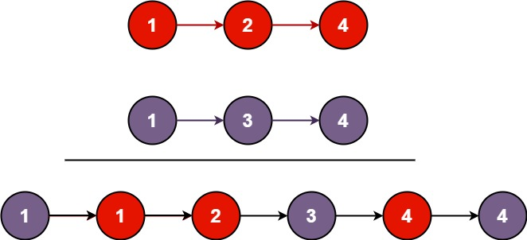

# Leetcode

## 0021 Merge Two Sorted Lists

### Question

You are given the heads of two sorted linked lists list1 and list2.

Merge the two lists in a one sorted list. The list should be made by splicing together the nodes of the first two lists.

Return the head of the merged linked list.

### Example 1



Input: list1 = [1,2,4], list2 = [1,3,4]
Output: [1,1,2,3,4,4]

### Example 2

Input: list1 = [], list2 = []
Output: []

### Example 3

Input: list1 = [], list2 = [0]
Output: [0]

### Constraints

The number of nodes in both lists is in the range [0, 50].
-100 <= Node.val <= 100
Both list1 and list2 are sorted in non-decreasing order.

%

### Key Point

### Solution 1

```java
class Solution {
    public ListNode mergeTwoLists(ListNode list1, ListNode list2) {
        ListNode dummy = new ListNode(-1), pre = dummy;

        while(list1 != null && list2 != null) {

            pre.next = list1.val < list2.val ? list1 : list2;
            list1 = list1.val < list2.val ? list1.next : list1;
            list2 = list1.val < list2.val ? list2.next : list2;

            pre = pre.next;
        }
        pre.next = list1 == null ? list2 : list1;
        return dummy.next;
    }
}
```
