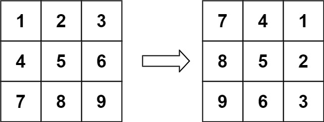
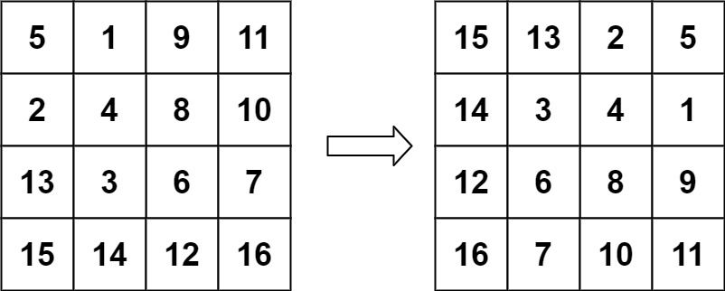

# Leetcode

## 0048 Rotate Image

### Question

You are given an n x n 2D matrix representing an image, rotate the image by 90 degrees (clockwise).

You have to rotate the image in-place, which means you have to modify the input 2D matrix directly. DO NOT allocate another 2D matrix and do the rotation.

### Example 1

  

Input: matrix = [[1,2,3],[4,5,6],[7,8,9]]
Output: [[7,4,1],[8,5,2],[9,6,3]]

### Example 2

  

Input: matrix = [[5,1,9,11],[2,4,8,10],[13,3,6,7],[15,14,12,16]]
Output: [[15,13,2,5],[14,3,4,1],[12,6,8,9],[16,7,10,11]]

### Constraints

n == matrix.length == matrix[i].length
1 <= n <= 20
-1000 <= matrix[i][j] <= 1000

%

### Key Point

1. 用矩阵转置与左右颠倒来完成旋转操作
2. 注意，转置只需循环上半部分，颠倒用双指针

### Solution 1

```java
class Solution {
    public void rotate(int[][] matrix) {
        
        int row = matrix.length, col = matrix[0].length; 
        for(int i = 0; i < row; ++i) {
            for(int j = i; j < col; ++j) {
                int tmp = matrix[i][j];
                matrix[i][j] = matrix[j][i];
                matrix[j][i] = tmp;
            }
        }

        for (int i = 0; i < row; ++i) {
            int l = 0, r = col -1;
            while ( l < r) {
                int tmp = matrix[i][l];
                matrix[i][l] = matrix[i][r];
                matrix[i][r] = tmp;
                l++;
                r--;
            }
        }

    }
}
```
