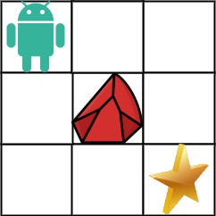

# Leetcode

## 0063 Unique Paths II

### Question

You are given an m x n integer array grid. There is a robot initially located at the top-left corner (i.e., `grid[0][0]`). The robot tries to move to the bottom-right corner (i.e., `grid[m-1][n-1]`). The robot can only move either down or right at any point in time.

An obstacle and space are marked as 1 or 0 respectively in grid. A path that the robot takes cannot include any square that is an obstacle.

Return the number of possible unique paths that the robot can take to reach the bottom-right corner.

The testcases are generated so that the answer will be less than or equal to 2 * 109.

### Example 1

  

Input: obstacleGrid = [[0,0,0],[0,1,0],[0,0,0]]
Output: 2
Explanation: There is one obstacle in the middle of the 3x3 grid above.
There are two ways to reach the bottom-right corner:

1. Right -> Right -> Down -> Down
2. Down -> Down -> Right -> Right

### Example 2

  

Input: obstacleGrid = [[0,1],[0,0]]
Output: 1

### Constraints

m == obstacleGrid.length
n == obstacleGrid[i].length
1 <= m, n <= 100
`obstacleGrid[i][j]` is 0 or 1.

%

### Key Point

1. DP 五部曲
1. 初始化需要注意

### Solution 1

```java
class Solution {
    public int uniquePathsWithObstacles(int[][] obstacleGrid) {
        int m = obstacleGrid.length;
        int n = obstacleGrid[0].length;
        if(obstacleGrid[0][0] == 1) return 0;

        int[][] dp = new int[m][n];
        for(int i = 0; i < m && obstacleGrid[i][0] == 0; ++i) dp[i][0] = 1;
        for(int i = 0; i < n && obstacleGrid[0][i] == 0; ++i) dp[0][i] = 1;

        for(int i = 1; i < m; ++i) {
            for(int j = 1; j < n; ++j) {
                if(obstacleGrid[i][j] == 1){
                    dp[i][j] = 0;
                } else {
                    dp[i][j] = dp[i - 1][j] + dp[i][j - 1];
                }
            }
        }
        return dp[m - 1][n - 1];
    }
}
```
