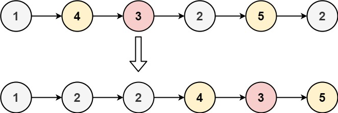

# Leetcode

## 0086 Partition List

### Question

Given the head of a linked list and a value x, partition it such that all nodes less than x come before nodes greater than or equal to x.

You should preserve the original relative order of the nodes in each of the two partitions.

### Example 1



Input: head = [1,4,3,2,5,2], x = 3
Output: [1,2,2,4,3,5]

### Example 2

Input: head = [2,1], x = 2
Output: [1,2]

### Constraints

The number of nodes in the list is in the range [0, 200].
-100 <= Node.val <= 100
-200 <= x <= 200

%

### Key Point

1. 分裂为2个链表，一个大一个小
2. 最后连接两个链表

### Solution 1

```java
class Solution {
    public ListNode partition(ListNode head, int x) {
        ListNode small = new ListNode(0);
        ListNode large = new ListNode(0);
        ListNode smallHead = small;
        ListNode largeHead = large;
        while (head != null) {
            if (head.val < x) {
                small.next = head;
                small = small.next;
            } else {
                large.next = head;
                large = large.next;
            }
            head = head.next;
        }
        large.next = null;
        small.next = largeHead.next;
        return smallHead.next;
    }
}
```
