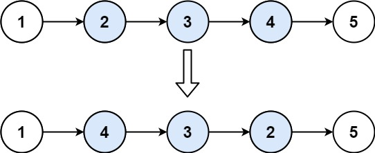

# Leetcode

## 0092 Reverse Linked List II

### Question

Given the head of a singly linked list and two integers left and right where left <= right, reverse the nodes of the list from position left to position right, and return the reversed list.

### Example 1

  

Input: head = [1,2,3,4,5], left = 2, right = 4
Output: [1,4,3,2,5]

### Example 2

Input: head = [5], left = 1, right = 1
Output: [5]

### Constraints

The number of nodes in the list is n.
1 <= n <= 500
-500 <= Node.val <= 500
1 <= left <= right <= n

%

### Key Point

1. 递归代码简练，需要仔细，容易出错
2. 迭代开销更小

### Solution 1

```java
/**
 * Definition for singly-linked list.
 * public class ListNode {
 *     int val;
 *     ListNode next;
 *     ListNode() {}
 *     ListNode(int val) { this.val = val; }
 *     ListNode(int val, ListNode next) { this.val = val; this.next = next; }
 * }
 */
class Solution {

    ListNode successor;

    private ListNode reverseN(ListNode head, int n) {
        if(head == null || n == 1) {
            successor = head.next;
            return head;
        }

        ListNode last = reverseN(head.next, n - 1);

        head.next.next = head;
        head.next = successor;
        return last;
    }

    public ListNode reverseBetween(ListNode head, int left, int right) {

        if(head == null || head.next == null) return head;

        if(left == 1) {
            return reverseN(head, right);
        }

        head.next = reverseBetween(head.next, left - 1, right - 1);
        return head;
   }
}
```
