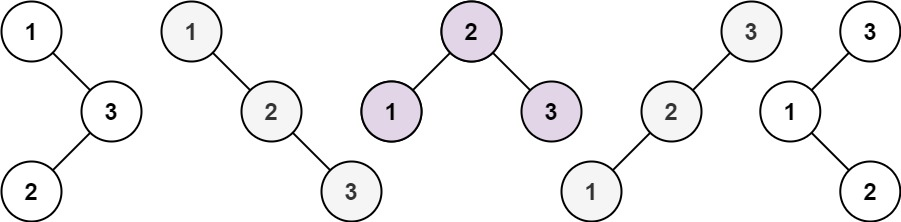

# Leetcode

## 0096 Unique Binary Search Trees

### Question

Given an integer n, return the number of structurally unique BST's (binary search trees) which has exactly n nodes of unique values from 1 to n.

### Example 1

  

Input: n = 3
Output: 5

### Example 2

Input: n = 1
Output: 1

### Constraints

1 <= n <= 19

%

### Key Point

### Solution 1

```java
class Solution {
    public int numTrees(int n) {
        if(n <= 2) return n;

        int[] dp = new int[n + 1];
        dp[0] = 1;
        // dp[1] = 1;
        // dp[2] = 2;
        for(int i = 1; i <= n; ++i) {
            for(int j = 1; j <= i; ++j){
                dp[i] += dp[i - j] * dp[j - 1];
            }
        }
        return dp[n];

    }
}
```
