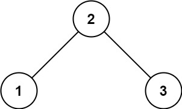
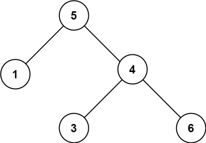

# Leetcode

## 0098 Validate Binary Search Tree

### Question

Given the root of a binary tree, determine if it is a valid binary search tree (BST).

A valid BST is defined as follows:

The left subtree of a node contains only nodes with keys less than the node's key.
The right subtree of a node contains only nodes with keys greater than the node's key.
Both the left and right subtrees must also be binary search trees.

### Example 1

  

Input: root = [2,1,3]
Output: true

### Example 2

  

Input: root = [5,1,4,null,null,3,6]
Output: false
Explanation: The root node's value is 5 but its right child's value is 4.

### Constraints

The number of nodes in the tree is in the range [1, 104].
-231 <= Node.val <= 231 - 1

%

### Key Point

1. 方法一，中序遍历，不需要记录全部节点，只需要保留前一个节点，保证递增即可
2. 方法二，用迭代实现遍历
3. 方法三，递归中序遍历，带min，max参数

### Solution 1

1. pre 需要是long 的原因：如果root 是 MIN_VALUE，会出错；需要初始化一个更小的数
2. pre 是全局变量，其实就是中序遍历中放队列的地方。

```java
public class Solution{

    long pre = Long.MIN_VALUE;

    private boolean traverse(TreeNode root) {
        if(root == null) return true;

        if(!traverse(root.left)) return false;
        
        // inorder
        if( pre >= root.val) return false;
        pre = root.val;

        return traverse(root.right);

    }

    public boolean isValidBST(TreeNode root) {
        return traverse(root);

    }
}
```
