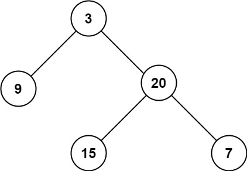

# Leetcode

## 0104 Maximum Depth of Binary Tree

### Question

Given the root of a binary tree, return its maximum depth.

A binary tree's maximum depth is the number of nodes along the longest path from the root node down to the farthest leaf node.

Example 1:
  

Input: root = [3,9,20,null,null,15,7]
Output: 3
Example 2:

Input: root = [1,null,2]
Output: 2

### Constraints

The number of nodes in the tree is in the range [0, 104].
-100 <= Node.val <= 100

%

### Key Point

1. 遍历二叉树，计算每一个节点的深度，取最大值
1. depth的加减应该在前序、后序位置，但比较并取res，可以在前中后任何位置。
1. 重要的是，用二叉树遍历的模板

### Solution 1

```java
class Solution {
        int res = 0;
        int depth = 0;

    private void traverse(TreeNode root) {
        if(root == null) return;

        // pre-order
        depth++;
        traverse(root.left);
        // in-order
        res = res > depth ? res : depth;
        traverse(root.right);
        // post-order
        depth--;
    }

    public int maxDepth(TreeNode root) {

        traverse(root);
        return res;

    }
}

/**
 * Definition for a binary tree node.
 * public class TreeNode {
 *     int val;
 *     TreeNode left;
 *     TreeNode right;
 *     TreeNode() {}
 *     TreeNode(int val) { this.val = val; }
 *     TreeNode(int val, TreeNode left, TreeNode right) {
 *         this.val = val;
 *         this.left = left;
 *         this.right = right;
 *     }
 * }
 */

```
