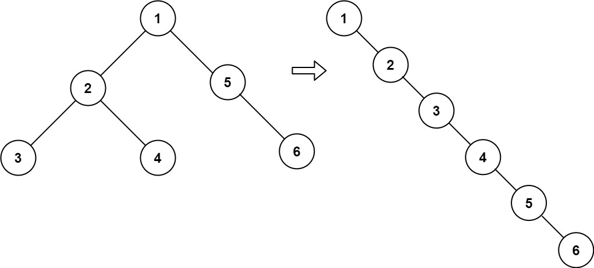
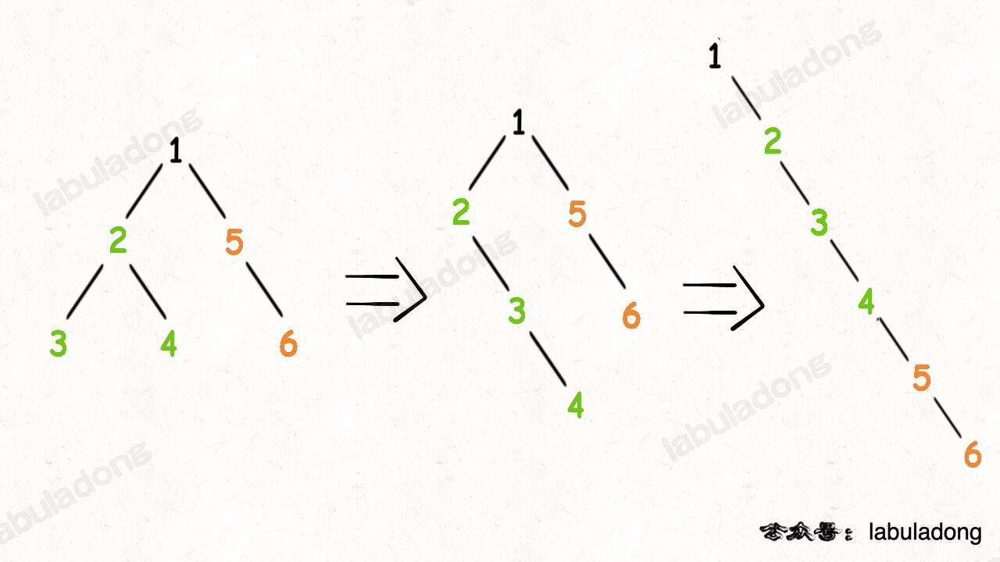

# Leetcode

## 0114 Flatten Binary Tree to Linked List

### Question

Given the root of a binary tree, flatten the tree into a "linked list":

The "linked list" should use the same TreeNode class where the right child pointer points to the next node in the list and the left child pointer is always null.
The "linked list" should be in the same order as a pre-order traversal of the binary tree.

### Example 1

  

Input: root = [1,2,5,3,4,null,6]
Output: [1,null,2,null,3,null,4,null,5,null,6]

### Example 2

Input: root = []
Output: []

### Example 3

Input: root = [0]
Output: [0]

### Constraints

The number of nodes in the tree is in the range [0, 2000].
-100 <= Node.val <= 100

### Follow up

Can you flatten the tree in-place (with O(1) extra space)?

%

### Key Point

1. 直接遍历，需要复制节点，需要O(n)空间；
1. 做后序遍历，假设左右子树都已经完成了；
1. 后序位置，将左子树设为空，右子树接原左子树，原左子树的尾部接上右子树；
  

### Solution 1

```java
class Solution {

    private void traverse(TreeNode root) {
        if(root == null) return;

        traverse(root.left);
        traverse(root.right);

        TreeNode left = root.left;
        TreeNode right = root.right;

        root.left = null;
        root.right = left;
        
        TreeNode p = root;
        while(p.right != null) p = p.right;
        p.right = right;

        return;


    }

    public void flatten(TreeNode root) {
        traverse(root);
        return;

    }
}
```
