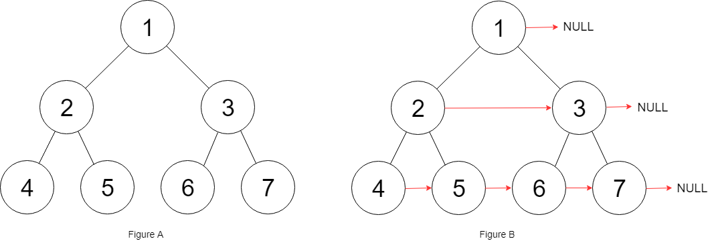
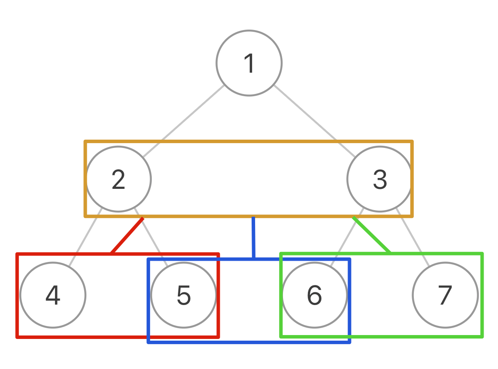

# Leetcode

## 0116 Populating Next Right Pointers in Each Node

### Question

You are given a perfect binary tree where all leaves are on the same level, and every parent has two children. The binary tree has the following definition:

```java
struct Node {
  int val;
  Node *left;
Node*right;
  Node *next;
}
```

Populate each next pointer to point to its next right node. If there is no next right node, the next pointer should be set to NULL.

Initially, all next pointers are set to NULL.

### Example 1

  

Input: root = [1,2,3,4,5,6,7]
Output: [1,#,2,3,#,4,5,6,7,#]
Explanation: Given the above perfect binary tree (Figure A), your function should populate each next pointer to point to its next right node, just like in Figure B. The serialized output is in level order as connected by the next pointers, with '#' signifying the end of each level.

### Example 2

Input: root = []
Output: []

### Constraints

The number of nodes in the tree is in the range [0, 212 - 1].
-1000 <= Node.val <= 1000

### Follow-up

You may only use constant extra space.
The recursive approach is fine. You may assume implicit stack space does not count as extra space for this problem.

%

### Key Point

1. 将左右两个节点组成的空看成一个节点，原二叉树变成三叉树
1. 遍历三叉树，做完左右连接即可。
1. 因为所有指针默认为null，所有最右边指针可以不处理。
  

### Solution 1

```java
class Solution {

    private void traverse(Node left, Node right) {
        if(left == null | right == null) return;

        // connect
        left.next = right;

        traverse(left.left, left.right);
        traverse(left.right, right.left);
        traverse(right.left, right.right);
        return;

    }

    public Node connect(Node root) {
        if(root == null) return null;
        
        traverse(root.left, root.right);
        return root;

    }
}
```
