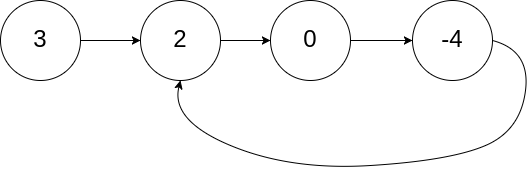

# Leetcode

## 0141 Linked List Cycle

### Question

Given head, the head of a linked list, determine if the linked list has a cycle in it.

There is a cycle in a linked list if there is some node in the list that can be reached again by continuously following the next pointer. Internally, pos is used to denote the index of the node that tail's next pointer is connected to. Note that pos is not passed as a parameter.

Return true if there is a cycle in the linked list. Otherwise, return false.

### Example 1



Input: head = [3,2,0,-4], pos = 1
Output: true
Explanation: There is a cycle in the linked list, where the tail connects to the 1st node (0-indexed).

### Example 2


Input: head = [1,2], pos = 0
Output: true
Explanation: There is a cycle in the linked list, where the tail connects to the 0th node.

### Example 3


Input: head = [1], pos = -1
Output: false
Explanation: There is no cycle in the linked list.

### Constraints

The number of the nodes in the list is in the range [0, 104].
$-10^5 <= Node.val <= 10^5$
pos is -1 or a valid index in the linked-list.

%

### Key Point

1. 快慢指针，一个每次走1步，一个每次走2步
2. 相遇表示有环，且此时快指针多走了一个环的长度（或者整数倍）

### Solution

```java
public class Solution {
    public boolean hasCycle(ListNode head) {
        ListNode slow = head, fast = head;
        while (fast != null && fast.next != null) {
            fast = fast.next.next;
            slow = slow.next;
            if(fast == slow)
                return true;
        }
        return false;
    }
}
```
