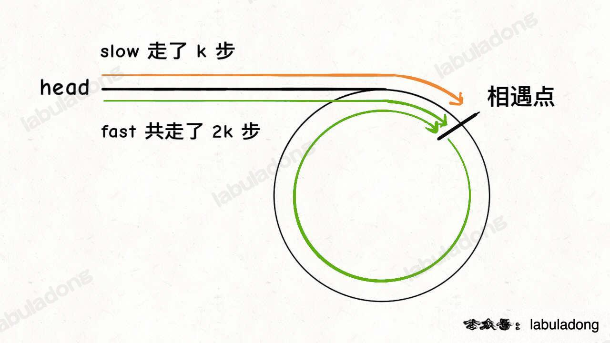
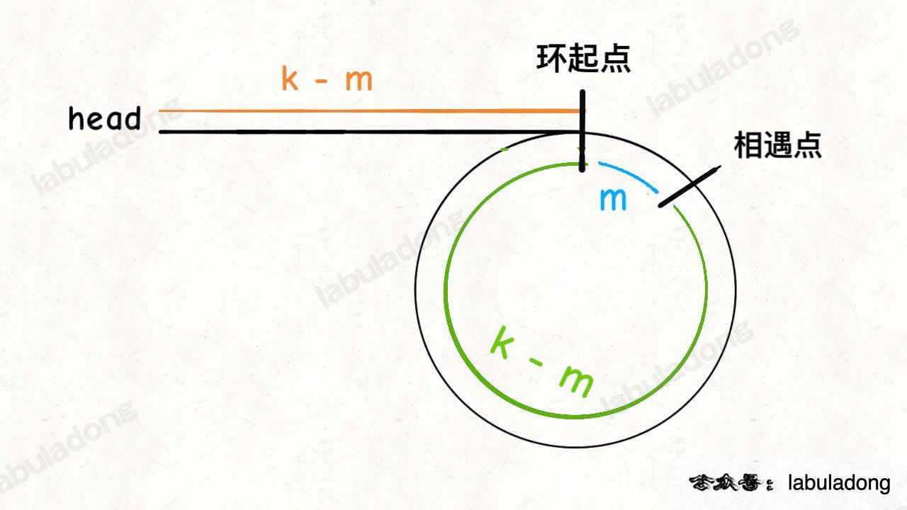

# Leetcode

## 0142 Linked List Cycle II

### Question

Given the head of a linked list, return the node where the cycle begins. If there is no cycle, return null.

There is a cycle in a linked list if there is some node in the list that can be reached again by continuously following the next pointer. Internally, pos is used to denote the index of the node that tail's next pointer is connected to (0-indexed). It is -1 if there is no cycle. Note that pos is not passed as a parameter.

Do not modify the linked list.

### Example 1

Input: head = [3,2,0,-4], pos = 1
Output: tail connects to node index 1
Explanation: There is a cycle in the linked list, where tail connects to the second node.

### Example 2

Input: head = [1,2], pos = 0
Output: tail connects to node index 0
Explanation: There is a cycle in the linked list, where tail connects to the first node.

### Example 3

Input: head = [1], pos = -1
Output: no cycle
Explanation: There is no cycle in the linked list.

%

### Key Point

1. slow 前进一步，fast 就前进两步。先解决环的存在性问题；
2. 相遇时，让其中任一个指针指向头节点，然后让它俩以相同速度前进，
3. 再次相遇时所在的节点位置就是环开始的位置。

* 原因

fast 一定比 slow 多走了 k 步，这多走的 k 步其实就是 fast 指针在环里转圈圈，所以 k 的值就是环长度的「整数倍」。

假设，环的起点距头结点 head 的距离为 k - m，也就是说如果从 head 前进 k - m 步就能到达环起点。
巧的是，如果从相遇点继续前进 k - m 步，也恰好到达环起点。

### Solution

```java
public class Solution{
    public ListNode detectCycle(ListNode head){
        ListNode slow = head, fast = head;
        while (fast != null && fast.next != null) {
            slow = slow.next;
            fast = fast.next.next;
            if(slow == fast)
                break;
        }
        if(fast == null || fast.next == null)
            return null;

        slow = head;
        while(slow != fast) {
            slow = slow.next;
            fast = fast.next;
        }
        return slow;
    }
}

```
