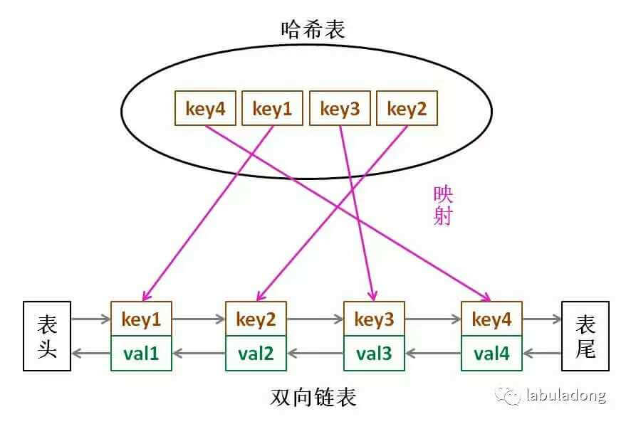

# Leetcode

## 0146  LRU Cache

### Question

Design a data structure that follows the constraints of a Least Recently Used (LRU) cache.

Implement the LRUCache class:

LRUCache(int capacity) Initialize the LRU cache with positive size capacity.
int get(int key) Return the value of the key if the key exists, otherwise return -1.
void put(int key, int value) Update the value of the key if the key exists. Otherwise, add the key-value pair to the cache. If the number of keys exceeds the capacity from this operation, evict the least recently used key.
The functions get and put must each run in O(1) average time complexity.

### Example 1

Input
["LRUCache", "put", "put", "get", "put", "get", "put", "get", "get", "get"]
[[2], [1, 1], [2, 2], [1], [3, 3], [2], [4, 4], [1], [3], [4]]
Output
[null, null, null, 1, null, -1, null, -1, 3, 4]

Explanation
LRUCache lRUCache = new LRUCache(2);
lRUCache.put(1, 1); // cache is {1=1}
lRUCache.put(2, 2); // cache is {1=1, 2=2}
lRUCache.get(1);    // return 1
lRUCache.put(3, 3); // LRU key was 2, evicts key 2, cache is {1=1, 3=3}
lRUCache.get(2);    // returns -1 (not found)
lRUCache.put(4, 4); // LRU key was 1, evicts key 1, cache is {4=4, 3=3}
lRUCache.get(1);    // return -1 (not found)
lRUCache.get(3);    // return 3
lRUCache.get(4);    // return 4

### Constraints

1 <= capacity <= 3000
0 <= key <= 104
0 <= value <= 105
At most 2 * 105 calls will be made to get and put.

%

### Key Point

1. 用双向链表+ HashMap 实现，可以用 LinkedHashMap
2. 链表尾部为最新调用的key，头部为最老的；删除从头部开始，同时删除 HashMap 中的数据；
3. 调用原有的数据 从 HashMap 中查找，找到后更新双向链表

  

### Solution 1

```java
class LRUCache {
    int cap;
    LinkedHashMap<Integer, Integer> cache = new LinkedHashMap<>();
    public LRUCache(int capacity) { 
        this.cap = capacity;
    }
    
    public int get(int key) {
        if (!cache.containsKey(key)) {
            return -1;
        }
        // 将 key 变为最近使用
        makeRecently(key);
        return cache.get(key);
    }
    
    public void put(int key, int val) {
        if (cache.containsKey(key)) {
            // 修改 key 的值
            cache.put(key, val);
            // 将 key 变为最近使用
            makeRecently(key);
            return;
        }
        
        if (cache.size() >= this.cap) {
            // 链表头部就是最久未使用的 key
            int oldestKey = cache.keySet().iterator().next();
            cache.remove(oldestKey);
        }
        // 将新的 key 添加链表尾部
        cache.put(key, val);
    }
    
    private void makeRecently(int key) {
        int val = cache.get(key);
        // 删除 key，重新插入到队尾
        cache.remove(key);
        cache.put(key, val);
    }
}
```
