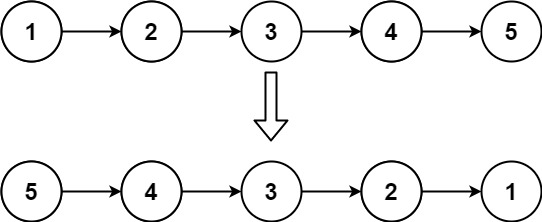

# Leetcode

## 0026 Reverse Linked List

### Question

Given the head of a singly linked list, reverse the list, and return the reversed list.

### Example 1

  

Input: head = [1,2,3,4,5]
Output: [5,4,3,2,1]

### Example 2

  

Input: head = [1,2]
Output: [2,1]

### Example 3

Input: head = []
Output: []

### Constraints

The number of nodes in the list is the range [0, 5000].
-5000 <= Node.val <= 5000

%

### Key Point

### Solution 1

* 迭代方式

1. 保存前中后 的指针
2. 只修改 中 指针；

```java
class Solution {
    public ListNode reverseList(ListNode head) {
        if(head == null || head.next == null) return head;

        ListNode prev = null, curr = head;
        while(curr != null) {
            ListNode next = curr.next;
            curr.next = prev;
            prev = curr;
            curr = next;
        }
        return prev;
    }
}
```

### Solution 2

* 递归调用，

1. 先设退出条件
2. 然后递归表达式
3. 最后是假设递归到最后一个元素，需要做什么；

```java
class Solution {
    public ListNode reverseList(ListNode head) {
        if(head == null || head.next == null) return head;

        ListNode last = reverseList(head.next);

        head.next.next = head;
        head.next = null;
        return last;
    }
}
```
