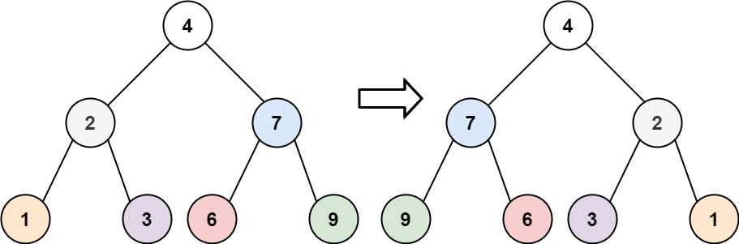
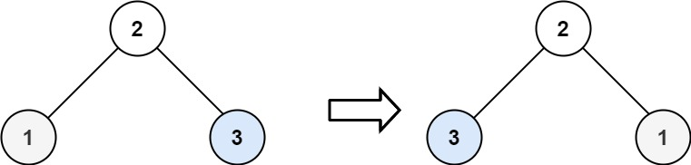

# Leetcode

## 0226 Invert Binary Tree

### Question

Given the root of a binary tree, invert the tree, and return its root.

### Example 1

  

Input: root = [4,2,7,1,3,6,9]
Output: [4,7,2,9,6,3,1]

### Example 2

  

Input: root = [2,1,3]
Output: [2,3,1]

### Example 3

Input: root = []
Output: []

### Constraints

The number of nodes in the tree is in the range [0, 100].
-100 <= Node.val <= 100

%

### Key Point

1. 遍历，将每个节点的左右子树交换即可；
1. 处理可以在前序或者后序位置，但为什么不能在中序位置？

### Solution 1

```java
class Solution {

    private void traverse(TreeNode root) {
        if(root == null) return;

        traverse(root.left);

        traverse(root.right);
        // swap
        TreeNode tmp = root.left;
        root.left = root.right;
        root.right = tmp;


        return;

    }

    public TreeNode invertTree(TreeNode root) {
        traverse(root);
        return root;

    }
}
```
