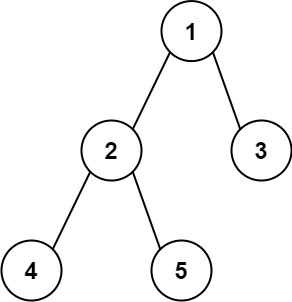

# Leetcode

## 0543 Diameter of Binary Tree

### Question

Given the root of a binary tree, return the length of the diameter of the tree.

The diameter of a binary tree is the length of the longest path between any two nodes in a tree. This path may or may not pass through the root.

The length of a path between two nodes is represented by the number of edges between them.

### Example 1

  

Input: root = [1,2,3,4,5]
Output: 3
Explanation: 3 is the length of the path [4,2,1,3] or [5,2,1,3].

### Example 2

Input: root = [1,2]
Output: 1

### Constraints

The number of nodes in the tree is in the range [1, 104].
-100 <= Node.val <= 100

%

### Key Point

1. 二叉树直径 = 左右子树深度和
2. 二叉树深度 = 左右子树的较大值
3. 在这之上，就是标准二叉树遍历

### Solution 1

```java
class Solution {
        int res = 0;

    private int traverse(TreeNode root) {
        if(root == null) return 0;

        int left = traverse(root.left);
        int right = traverse(root.right);
        // post-order
        int diameter = left + right;
        res = res > diameter ? res : diameter;
        return left > right ? left + 1 : right + 1;
    }

    public int diameterOfBinaryTree(TreeNode root) {

        traverse(root);
        return res;

    }
}

/**
 * Definition for a binary tree node.
 * public class TreeNode {
 *     int val;
 *     TreeNode left;
 *     TreeNode right;
 *     TreeNode() {}
 *     TreeNode(int val) { this.val = val; }
 *     TreeNode(int val, TreeNode left, TreeNode right) {
 *         this.val = val;
 *         this.left = left;
 *         this.right = right;
 *     }
 * }
 */
```
