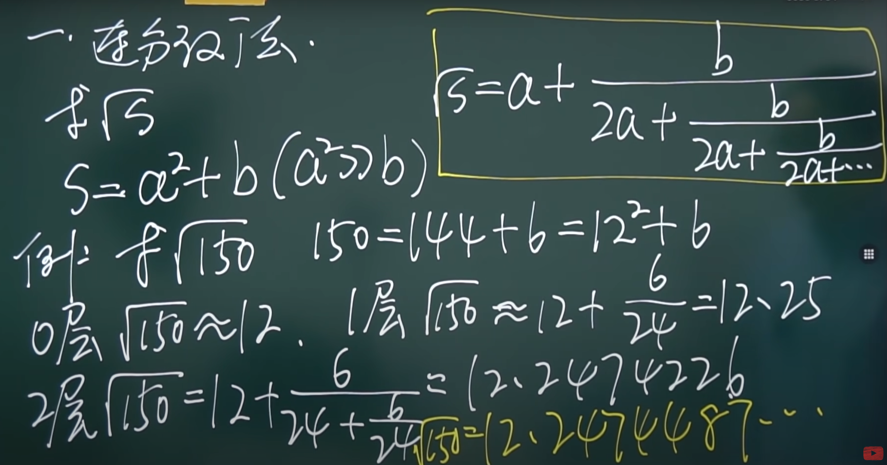
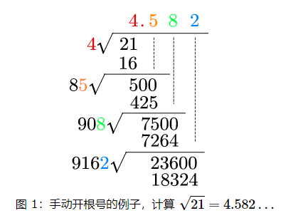

# Other

## 手动开根号

如何手动开根号？2种方法。

1. 连分法
1. 长除法
1. 牛顿迭代法

%

## Solution 1

连分法

  

## Solution 2

长除法

  

## Solution 3

牛顿迭代法

$$x_{i+1} = \frac{x_i + n/x_i}{2} $$

例子，计算 $\sqrt{13}$ 的值

x[0] = 3;   // 估算一个起点
x[1] = (3 + 13/3)/2 = 11/3 = 3.6666
x[2] = (11/3 + 13/(11/3))/2 = 119/33 = 3.60606
x[3] = (119/33 + 13/(119/33))/2 = 3.6055513114336644

实际上
$\sqrt{13}$ = 3.605551275423989
